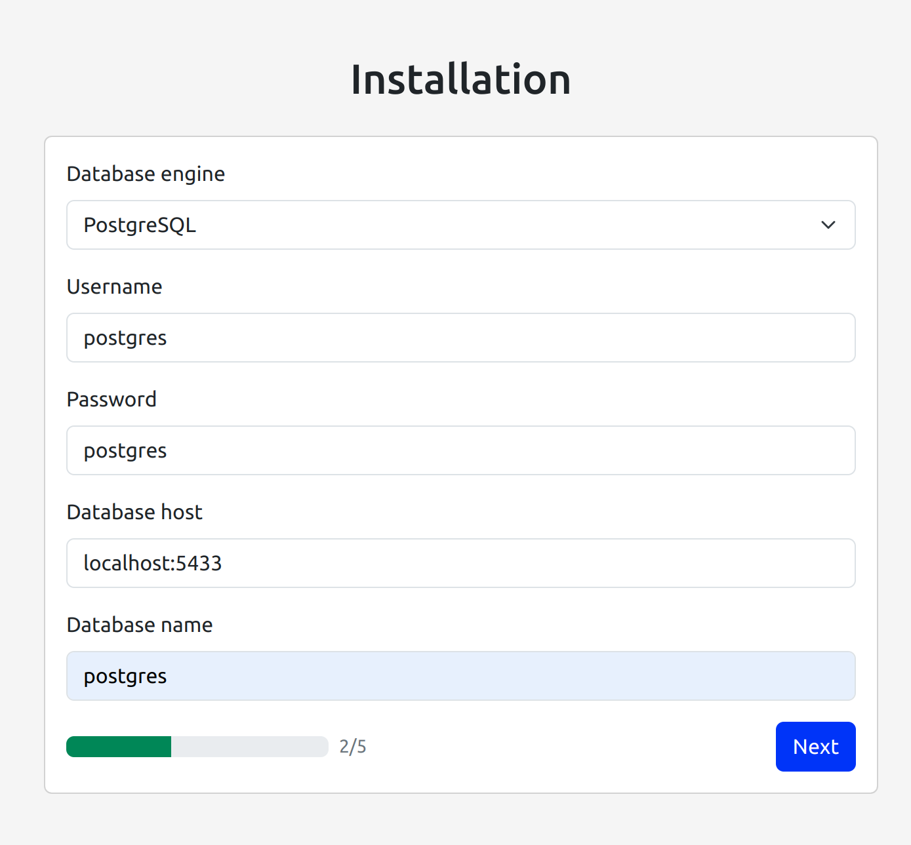
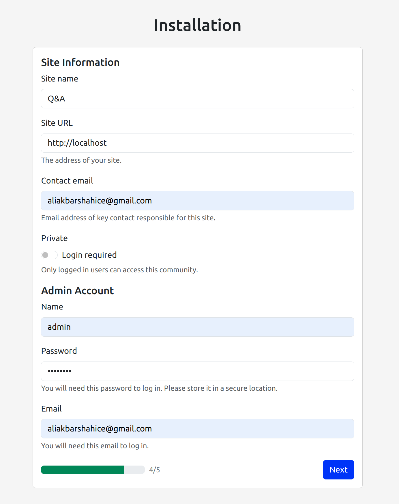
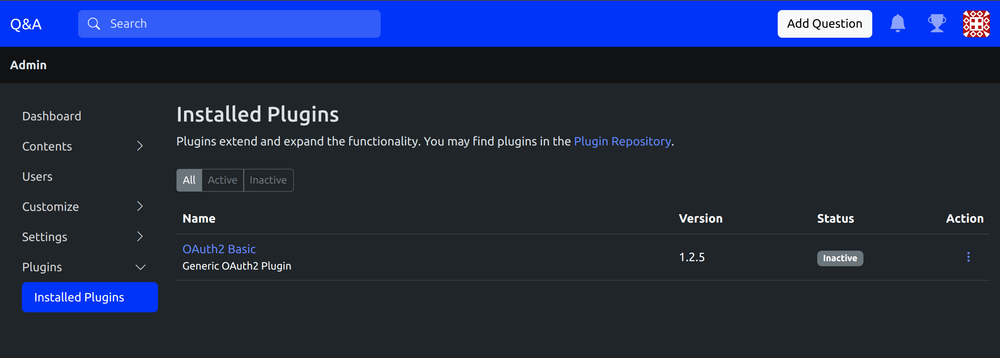
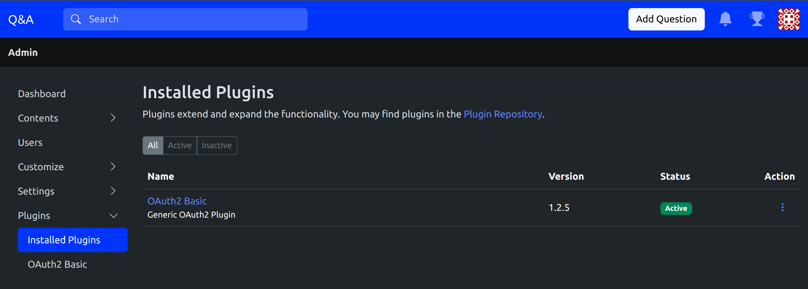
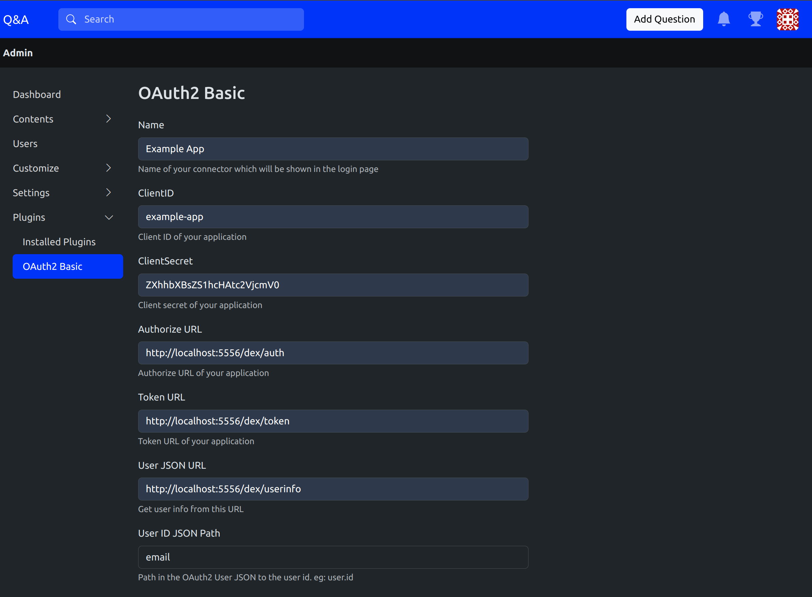
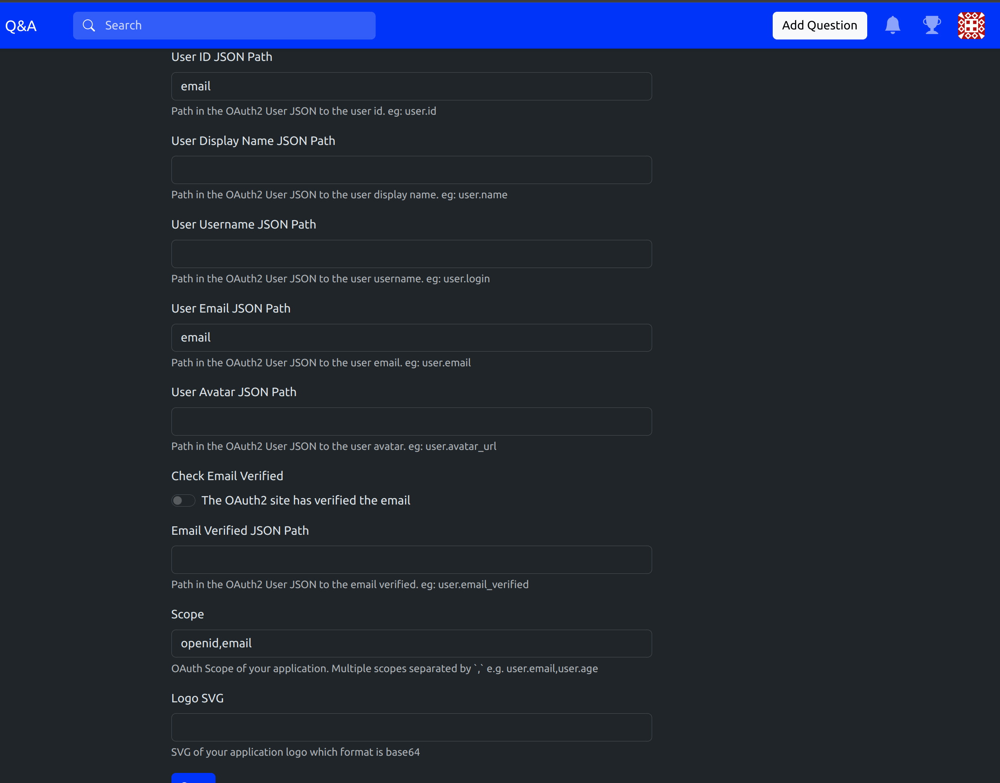
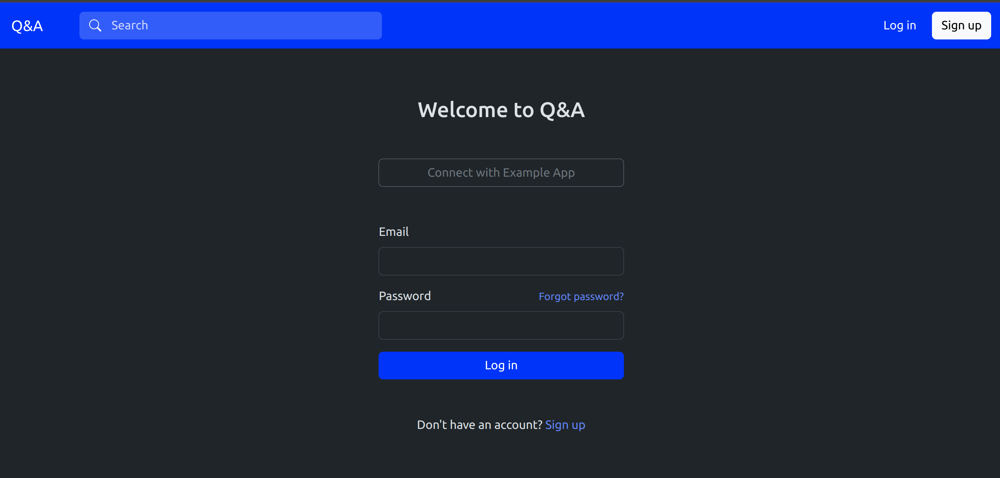
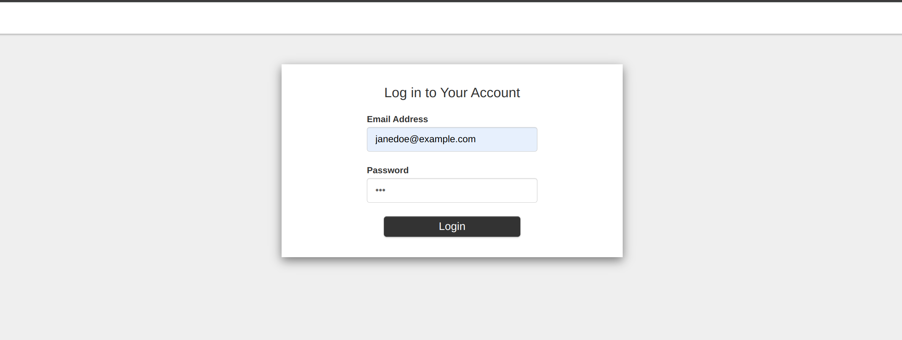
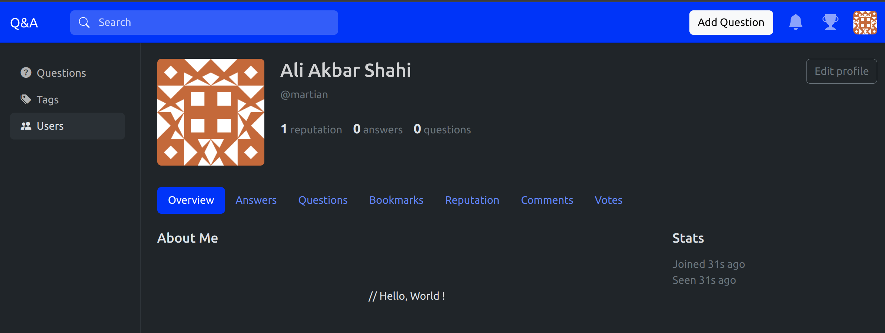

# apache-answer-dexidp-ldap

an example setup of [apache/incubator-answer](https://github.com/apache/incubator-answer) with [Dex](https://github.com/dexidp/dex) A federated OpenID Connect provider to support LDAP.


### getting started!

first run two compose.yml files:

```bash
    docker compose up
```
and 
```bash
    cd mock-ldap
    docker compose up
```
then go to `http://localhost`

- setup database like this


- then setup some configs like this


- then login with admin email and password, go to admin page and go to plugins


- then activate oauth2.0 basic plugin


- now setup dex parameters:



- now try to login with diffrent user:



- click connect with example app, this login with your ldap credential(eg. `janedoe@example.com` with pass: `foo`):


- and you can now update your profile:


